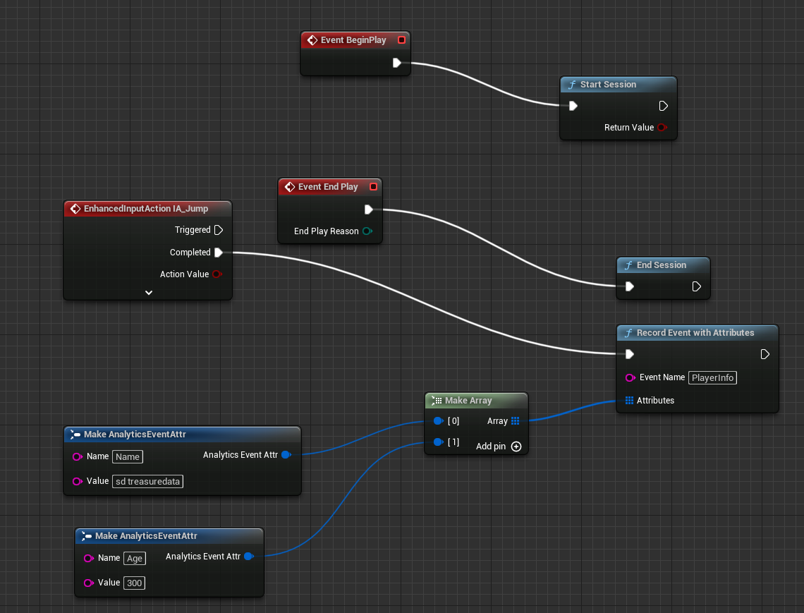

# Treasure Data Analytics Plugin for Unreal Engine 5

This plugin behaves as an Analytics Provider for Unreal Engine 5.

## Requirements

- Unreal Engine 5.3.0 

Follow the instructions in the link below to get access to UnrealEngine repository:

https://github.com/EpicGames/Signup

After getting access to the UnrealEngine repository, you should clone it to your local machine.

- [Treasure Data Write-Only API Key](https://console.treasuredata.com/app/users) (Click on User > API Keys)

## Getting Started

The following document assumes that the current Unreal Engine have been compiled from sources or it have all dependencies so third party plugins can be build.

### Download and place the plugin

Get a copy of the plugin from the main GIT repository:

```
$ git glone http://github.com/treasure-data/td-ue4-sdk
```

Switch to UE-5.3 branch:

```
$ git checkout UE-5.3
```

Copy the new __td-ue4-sdk__ to your Engine plugins folder, the target path looks like:

```
UnrealEngine/Engine/Plugins/td-ue4-sdk
```
> Alternative you can copy the plugin content inside your Project Plugin directory, not that this approach don't work on Linux Development environment.

### Build the plugin

Follow the steps in this documentation [UnrealEngine up and running](https://github.com/EpicGames/UnrealEngine#getting-up-and-running) to build the `td-ue4-sdk` plugin

### Enable the Analytics plugins for your project

Inside the Unreal Engine 5 Editor, open your project and the _plugins_ window:

- Edit > Plugins

Now enable the two required plugins:

- Blueprints: located at Built-in > Analytics 
- Treasure Data: located at Installed > Analytics 

### Configure Project settings

From your project directory, open and edit the file _Config/DefaultEngine.ini_ and append the following content at bottom:

```
[Analytics]
ProviderModuleName=TreasureData
TDApiKey=TD-WRITE-ONLY-KEY
TDDatabase=DATABASE_NAME
TDRegion=[US01,AP01,AP02,AP03,EU01]
SendInterval=10

[AnalyticsDevelopment]
ProviderModuleName=TreasureData
TDApiKey=TD-WRITE-ONLY-KEY
TDDatabase=DATABASE_NAME
TDRegion=[US01,AP01,AP02,AP03,EU01]
SendInterval=10

[AnalyticsTest]
ProviderModuleName=TreasureData
TDApiKey=TD-WRITE-ONLY-KEY
TDDatabase=DATABASE_NAME
TDRegion=[US01,AP01,AP02,AP03,EU01]
SendInterval=10
```

`TDDatabase` name must be shorter than 120 chars (The actual limitation: the total length of database and table must be shorter than 129 chars).

Save the file and restart Unreal Engine Editor.

### Gather metrics through Blueprints

In the Editor, click on the Blueprints dropdown menu and click on the _Open Level Blueprint_ option:


Now in the Event graphs, different events can be connected to Analytics functions, as an example the following image demonstrate how to track the _Session Start_, _Session End_ and _Record Event w/Attributes_ events:



After a Game starts, the plugin will send the events to Treasure Data.

## Treasure Data

In order to query the game events, go to the [Treasure Data Console](http://console.treasuredata.com), click on the _Databases_ item (left menu) and open the database used in the game (Config/DefaultEngine.ini > TDDatabase):


By default two tables are created:

- Sessions: start and stop sessions
- Events: All events with or without attributes.

To query records just click on any table name and click on the _Query_ top button. By default you can issue a SQL query like:

```
SELECT * from events;
```


